# Training Youtu-agent with AgentLightning


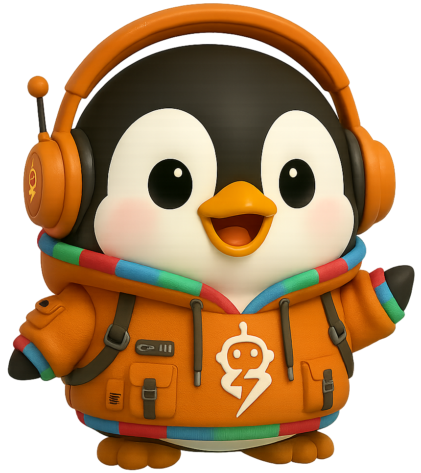


This repository is the modified version of [Agent Lightning](https://github.com/microsoft/agent-lightning/tree/contrib/youtu-agent-lightning) that is used to train your agents built by [Youtu-agent](https://github.com/TencentCloudADP/youtu-agent/tree/rl/agl). Modifications are made to the original **[AgentLightning@v0.2.2](https://github.com/microsoft/agent-lightning/releases/tag/v0.2.2)** for:

* scaling up training with more agent runners;
* fixing bugs when bridged with Youtu-agent;
* correcting GRPO advantage estimation for multi-turn trajectories;
* stabilizing RL training with tricks (e.g., filtering).


We have **verified the performaces** of code/math (ReTool) and search (SearchR1) tasks with multi-node training on **128 GPUs**. For details on how to reproduce the results, please refer to the [Quick Start](#quick-start) section ([Youtu-agent](https://github.com/TencentCloudADP/youtu-agent/tree/rl/agl) repository).


## Verified Training Performance


The RL training dynamics (at least 200 steps) of 7B instruct models are provided below for reference, confirming the effectiveness and stability of training with our repository. More performance gains are expected with prolonged training.


- [ReTool](https://api.wandb.ai/links/1275747829-fudan-university/vwxn21w2). AIME24: 0.10 (step 0) -> 0.45 (step 460).

<table>
  <tr>
    <td align="center">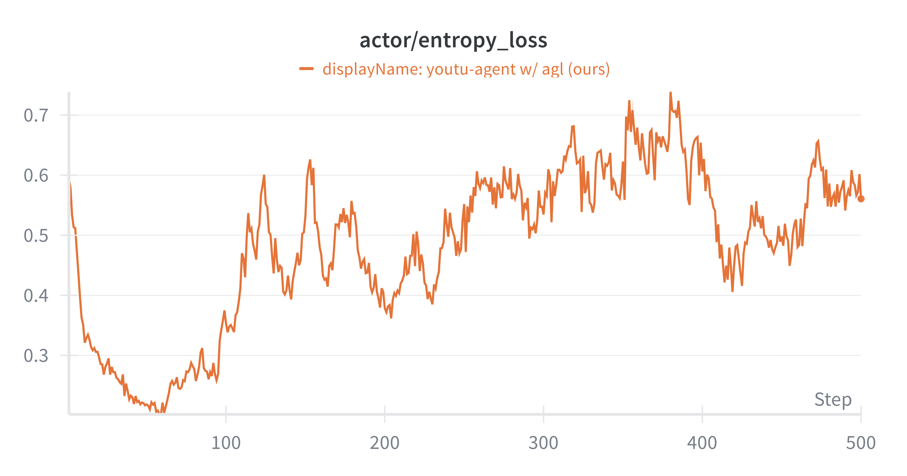</td>
    <td align="center">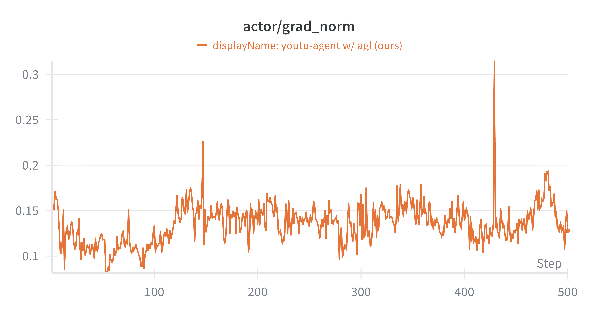</td>
    <td align="center">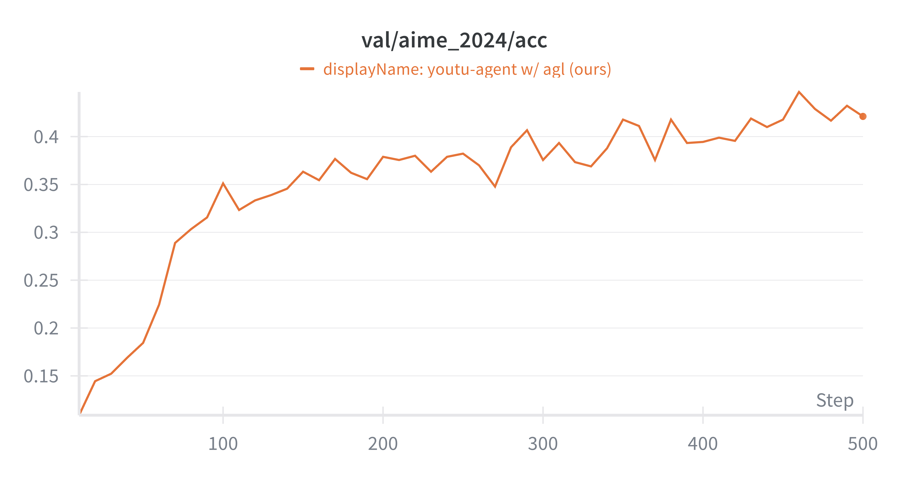</td>
  </tr>
</table>


- [SearchR1](https://api.wandb.ai/links/yuleiqin-tencent/0e2hs7io). TriviaQA: 0.37 (step 0) -> 0.54 (step 200); PopQA: 0.16 (step 0) -> 0.35 (step 200); NQ: 0.24 (step 0) -> 0.45 (step 200); MuSiQue: 0.06 (step 0) -> 0.14 (step 200); HotpotQA: 0.21 (step 0) -> 0.38 (step 200); Bamboogle: 0.23 (step 0) -> 0.36 (step 200); 2wiki: 0.22 (step 0) -> 0.32 (step 200).

<table>
  <tr>
    <td align="center">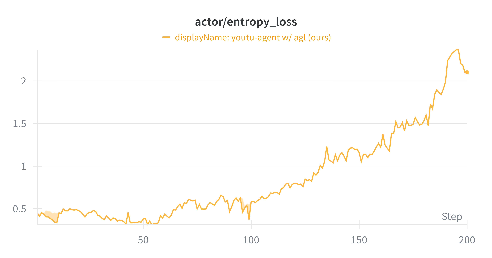</td>
    <td align="center">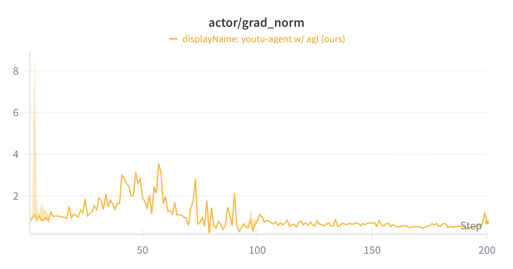</td>
    <td align="center">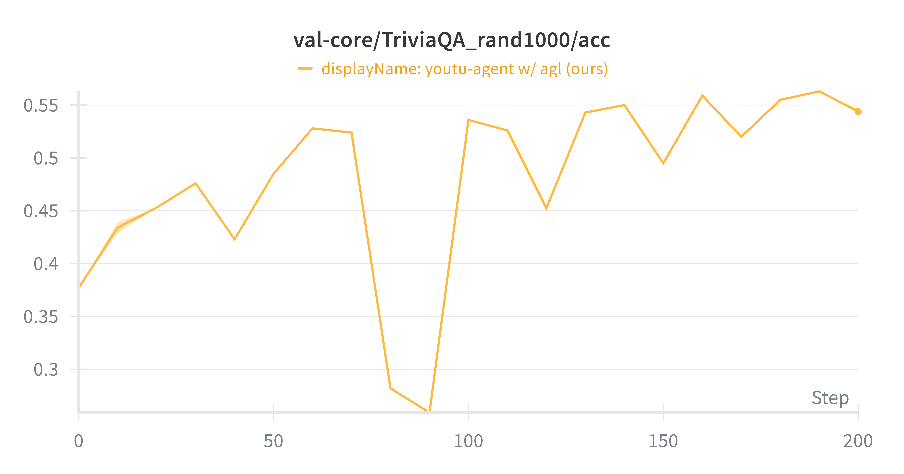</td>
  </tr>
  <tr>
    <td align="center">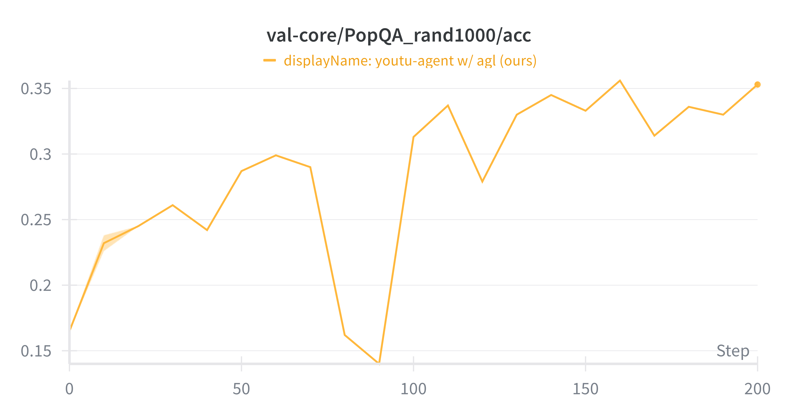</td>
    <td align="center">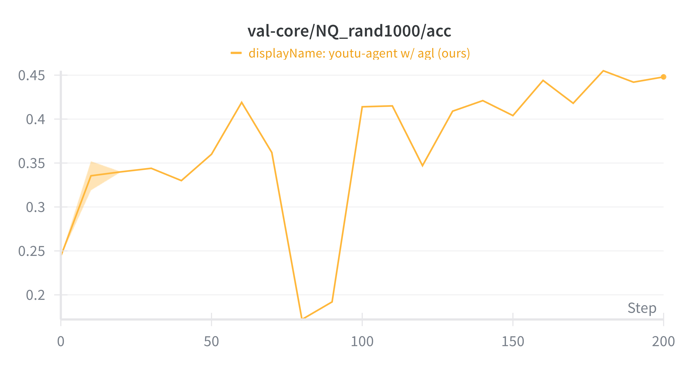</td>
    <td align="center">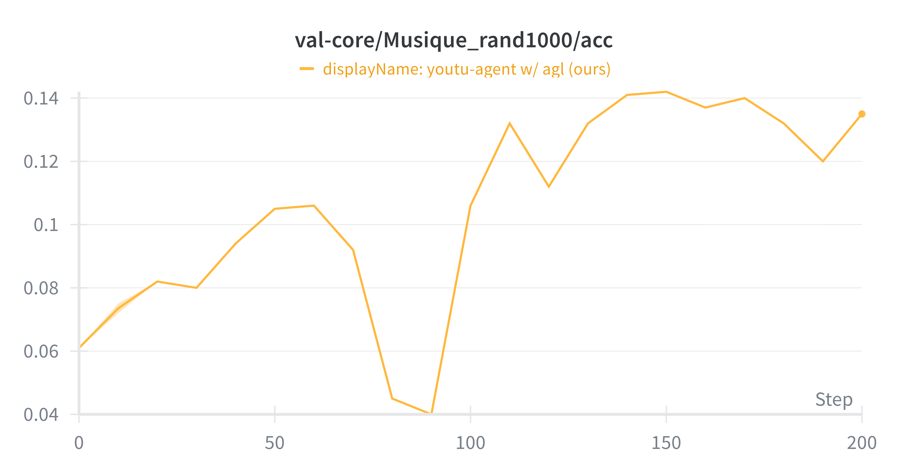</td>
  </tr>
  <tr>
    <td align="center">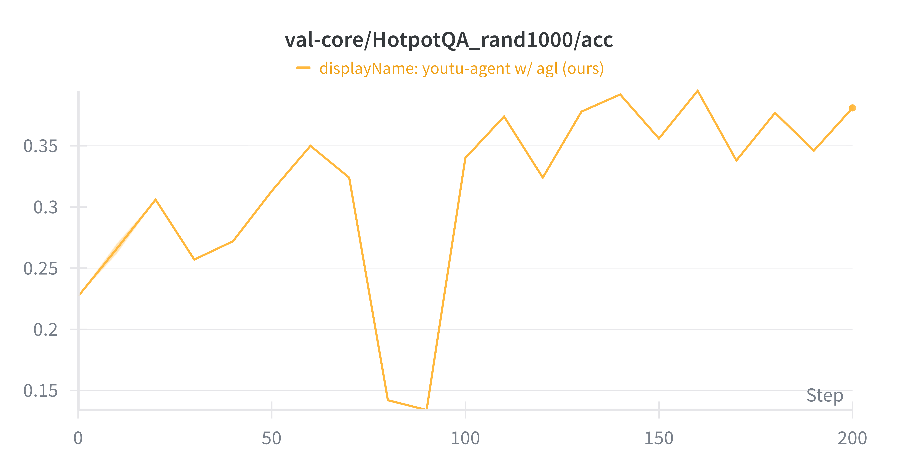</td>
    <td align="center">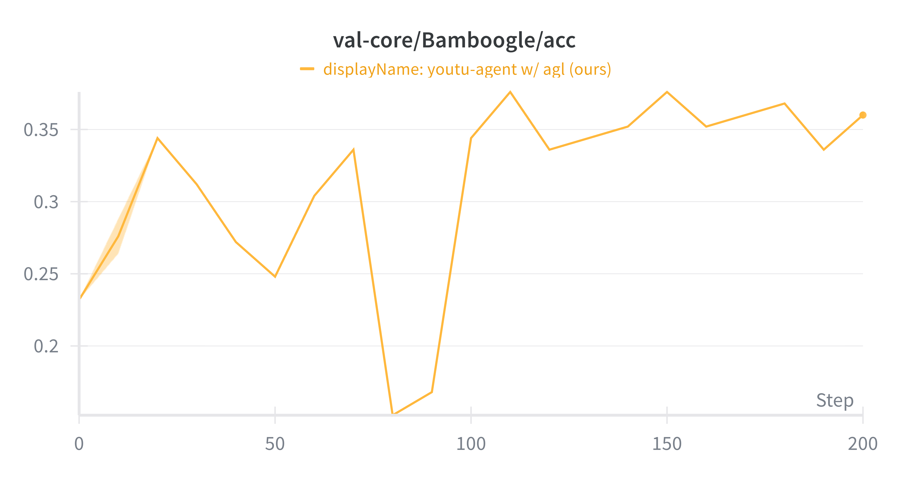</td>
    <td align="center">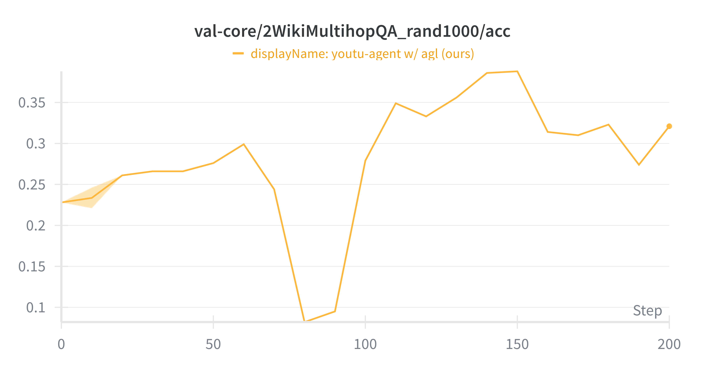</td>
  </tr>
</table>


## Quick Start

### Installation

Clone the project and install verl, agentlightning, and youtu-agent:

```bash
# create anaconda env (optional)
conda create -n agent-lightning python==3.12.0

# install verl
pip install verl==0.5.0

# install agent-lightning
git clone -b contrib/youtu-agent-lightning https://github.com/microsoft/agent-lightning.git
cd agent-lightning
pip install -e .

# install youtu-agent
cd ..
git clone -b rl/agl https://github.com/TencentCloudADP/youtu-agent.git
cd youtu-agent
pip install -e .
# modify your .env accordingly
cp .env.example .env
```


## Experimental Settings

We provide two agent learning examples that show how to train your LLM with [**Youtu-Agent**](https://github.com/TencentCloudADP/youtu-agent/tree/rl/agl) with [**Agent Lightning**](https://github.com/microsoft/agent-lightning/tree/contrib/youtu-agent-lightning): ReTool (code/math) and SearchR1 (search).

The detailed training and validation instructions are provided in the [**Youtu-Agent**](https://github.com/TencentCloudADP/youtu-agent/tree/rl/agl) repository.


## Acknowledgement

We sincerely appreciate the efforts from the following projects:

* Youtu-agent
```
@misc{youtu-agent-2025,
  title={Youtu-agent: A Simple yet Powerful Agent Framework},
  author={Tencent Youtu Lab},
  year={2025},
  publisher = {GitHub},
  journal = {GitHub repository},
  howpublished = {\url{https://github.com/TencentCloudADP/youtu-agent}},
}
```

* AgentLightning
```
@misc{luo2025agentlightningtrainai,
      title={Agent Lightning: Train ANY AI Agents with Reinforcement Learning},
      author={Xufang Luo and Yuge Zhang and Zhiyuan He and Zilong Wang and Siyun Zhao and Dongsheng Li and Luna K. Qiu and Yuqing Yang},
      year={2025},
      eprint={2508.03680},
      archivePrefix={arXiv},
      primaryClass={cs.AI},
      url={https://arxiv.org/abs/2508.03680},
}
```

* VeRL
```
@article{sheng2024hybridflow,
  title   = {HybridFlow: A Flexible and Efficient RLHF Framework},
  author  = {Guangming Sheng and Chi Zhang and Zilingfeng Ye and Xibin Wu and Wang Zhang and Ru Zhang and Yanghua Peng and Haibin Lin and Chuan Wu},
  year    = {2024},
  journal = {arXiv preprint arXiv: 2409.19256}
}
```

